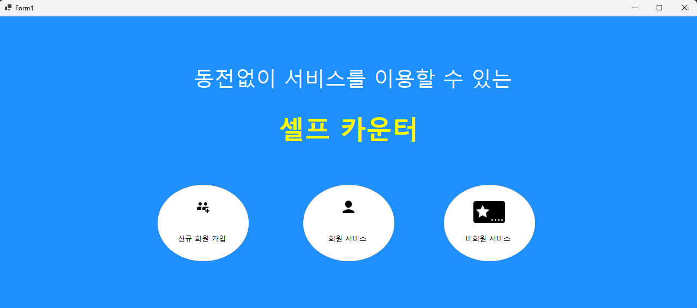
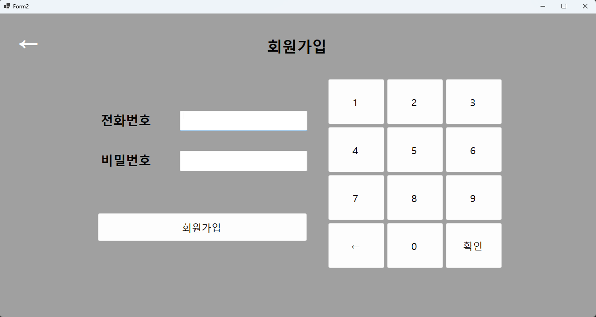
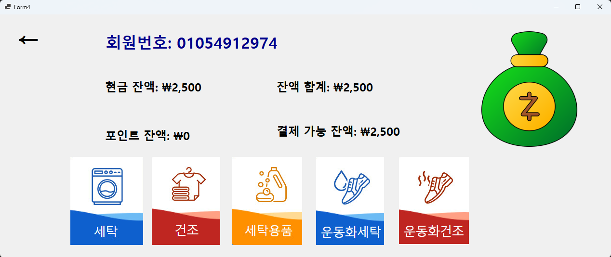
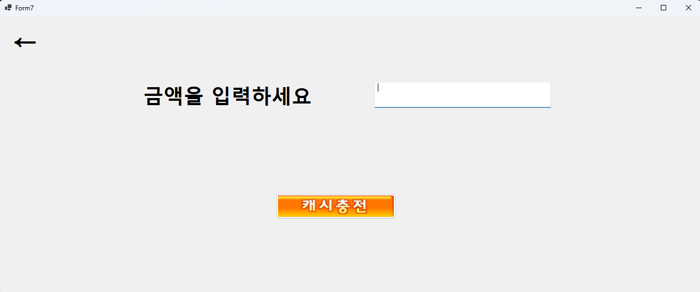
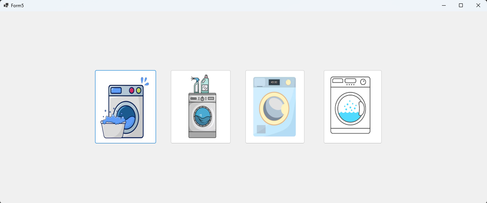
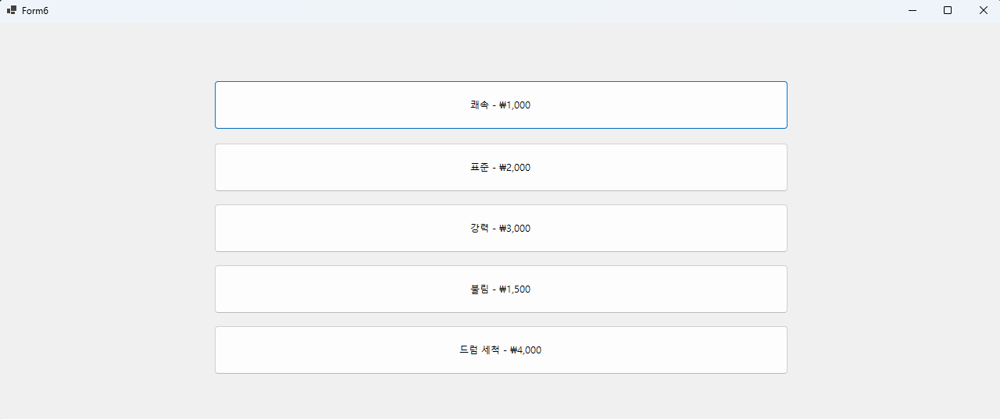

<h1>Laundry Kiosk</h1>

 
 2024. 10.10 ~ 2024. 10.14  
 C#과 WinForms를 사용하여 개발된 빨래방 키오스크 시스템입니다. 이 시스템은 MySQL 데이터베이스를 활용하여 사용자 정보를 관리하고, 잔액 충전 및 세탁기, 건조기 등 다양한 서비스 선택 기능을 제공합니다.

 
 

# **Development Environment**

| 항목 | 내용 |
| --- | --- |
| OS | Windows 10 |
| IDE | Visual Studio 2022 |
| Language | C# |
| FrameWork | WinForms |
| DataBase | MySQL 8.0 |

# **Features**

사용자는 전화번호로 로그인하여 잔액을 확인한 후 원하는 서비스를 선택하고 결제할 수 있습니다. 또한, 키오스크 시스템의 특성에 맞게 키다운 이벤트뿐만 아니라 버튼 클릭 이벤트도 함께 지원하여 터치스크린 환경에서도 편리하게 이용할 수 있도록 구현하였습니다.
# Docs 

 
<a href="https://nonchalant-practice-d82.notion.site/C-WinForms-1a643edb387c801b8c89e3423eaa64ca?pvs=4"> 📒 Notion
</a> 

# Members

| Name | Role |
| --- | --- |
| 황영진 | 전체 폼 UI 디자인, DB 설계, 기능 구현 |

# 실행화면

<table>
  <tr>
    <td>장바구니 담기</td>
    <td></td>
  </tr>
  <tr>
    <td>장바구니 상품 교환</td>
    <td></td>
  </tr>
  <tr>
    <td>상품 교환하기</td>
    <td></td>
  </tr>
  <tr>
    <td>상품 반품하기</td>
    <td></td>
  </tr>
  <tr>
    <td>상품 결제하기</td>
    <td></td>
  </tr>
  <tr>
    <td>세탁기 선택</td>
    <td></td>
  </tr>
  <tr>
    <td>세탁 메뉴 선택</td>
    <td></td>
  </tr>
</table>

# 시연 영상

  

